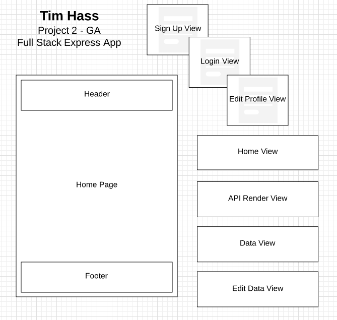
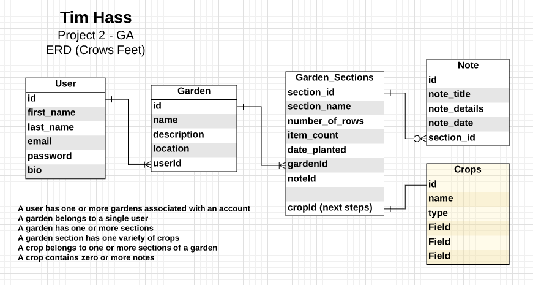

# EIEIO (eie.io) - Old MacDonald's First Garden App

Believe it or not Old MacDonald started off with a small backyard garden, this was long before he became
obsessed with writing songs about animals and farming.  This app was the first app he used "back in the day" to help him track, document, manage information about the plants in his garden; as well as query APIs to
obtain data, tips and other guidance related to the crops in his garden.

App is hosted at https://eieio-garden-app.herokuapp.com/
Project 2 - GA

## User Stories:
* As a user, I’d like to create an account to document, track and manage garden(s) that I plant crops in.
* As a user, I’d like to edit/update or delete my account profile.
* As a user, I’d like to add or delete a garden from my list of gardens.
* As a user, I’d like to add or delete a section of my garden.
* As a user, I’d like to add to or delete crops from a section within my garden.
* As a user, I’d like to add or delete notes concerning crops within a section within my garden.
* As a user, I’d like to query information about the crops within a section of my garden.

## Technologies Used
* HTML, CSS, jQuery, Javascript, Bootstrap,
* Node, Express, EJS Layouts, Bcrypt, Passport,
* PG/PG-HStore, Sequelize, Connect Flash, Morgan and Custom Middleware

## API Usage
This app uses data from the Growstuff API - http://growstuff.org/

## Documentation

### App Workflow
- Login


- Create Garden and Section


### Wire Frames


### Data Models


#### Data Tables
user
* Attributes: first_name, last_name, email, password, bio
* Associations: Has many gardens

garden
* Attributes: name, description, location, userId
* Associations: Belongs to one user, has many sections

section
* Attributes: name, description, number_of_rows, item_count, date_planted, gardenId (cropId for later use in expanding model)
* Associations: Belongs to one garden, Has many notes

notes
* Attributes: title, details, sectionId
* Associations: Belongs to one section

### CRUD Routes
Verb | Path | Action | Used for
------------ | ------------- | ------------ | -------------
GET | / | read | - returns index/home page
GET | auth/signup | read | - returns HTML for the signup page
POST | auth/signup | create | - create new user account
GET | auth/login | read | - returns HTML for to login page
POST | auth/login | create | - confirms user account credentials and opens new session
GET | auth/logout | read | - logs user out of current session
GET | user/profile | read | - returns HTML view of the user profile
GET | edit/profile/:id | read | - returns HTML form to update the user profile
PUT | update/:id | update | - updates user profile data
DELETE | delete/:id | delete | - deletes user profile and all associated data
GET | garden/new | read | - returns HTML form to create a new garden
GET | garden/add/:id | read | - returns HTML form allow the user to create a new garden section (API call)
POST | garden/new | create | - creates new garden renders HTML form to complete the creation of garden section after API call
GET | garden/show/:id | read | - returns HTML view of all users gardens and sections (if garden/sections have been created)
GET | garden/edit/:id | read | - returns HTML form to edit garden details
PUT | garden/update/:id | update | - updates garden with data provided
DELETE | garden/delete/:id | delete | - deletes garden and all associated data (sections/notes)
GET | section/show/:id | read | - returns HTML view of the section including crop information (API call)
GET | section/edit/:id | read | - returns HTML form to edit garden section details
POST | section/new | create | - creates new section returns HTML form to complete the creation of a new garden (or new section if adding) after API call
PUT | section/update/:id | update | - updates garden section with data provided
DELETE | section/delete/:id | delete | - deletes garden section and all associated data (notes)
GET | notes/new/:id | read | - returns HTML form to include a note for the section
POST | notes/new | create | - creates new note for section
PUT | NOT IN PLACE | update | - updates garden section note with data provided
DELETE | NOT IN PLACE | delete | - deletes garden section note

### Issues / Incomplete
- [x] background image was not loading in Heroku (naming convention for Heroku is case sensitive - changing JPG to jpg corrected the issue)
- [x] Provided a better user experience for section post route.
- [x] While a user is selecting a crop choice for a garden section the data has a long scroll (implement a better user experience).
- [ ] Provide a better user experience for garden list.
- [x] Provide better user feedback for garden and section actions.
- [ ] Garden Section include calculated data concerning crops in this section.
- [ ] Notes section PUT and DELETE routes for specific notes.
- [x] On User Account DELETE route issues, however account data is removed.

### Next Steps / Improvements
- [ ] Garden - Connect to Weather API to provide forecast data; maybe a user would want to plant just before it rains, or not while it will be raining.
- [ ] Garden Section - include data concerning crops in this section; such as, what should/shouldn't be planted next to the item, watering table, best types of fertilizer to use - would require an additional api source.
- [ ] Garden Section - Connect to YouTube API to provide gardening tip videos.
- [ ] Extend app to include groups and members for seed swapping and exchange of tips/ideas.
- [ ] Extend app by including additional data tables for crops, allowing a user to track seedlings from those crops.
- [ ] There is always improvements for user experience.

#### Development Process
DAY 1-3: Review code completed in class, created user edit (PUT) and delete routes in, posted boiler-plate to GitHub. Retrieved a copy of boiler-plate. Researched ideas, sketch out requirements, created initial wireframe, drafted data models and user stories.

DAY 4: Updated data models began building Sequelize models and making associations, created user and garden routes and supporting forms, reviewed USDA and other API data to determine feasibility of use (had to wait on keys). Found bug in Sequelize model associations with naming convention for join tables.

DAY 5: Reworked Sequelize models and associations, reviewed API documentation, incorporated initial api calls to obtain data.  Continue garden build routes and forms, made a few test routes to test database operations from form data.

DAY 6: Building section and crop routes.  Found a few items in my initial models that were not necessary, rebuilt data models. Reconsidered workflow and form submission, began redesign on forms needed for workflow.

DAY 7: Finalized new workflow. Found a bug on form data picker - Sequelize DATE data type returns in long date format, where a date picker requires the Sequilize DATEONLY data type to load in the correct format.  

DAY 8: (STILL HAVING MODEL ISSUES) Made a copy of my app, build a test db and reworked the Sequilize models until I got it the associations right.  (Sample of rebuild code below) Rebuilt models due to data model associations not working correctly (onDelete CASCADE). I should have tested this earlier in the process... I corrected this issue by rewriting the Sequelize Model and Migrations before creating the tables.  I also corrected the date_planted DATEONLY data type to resolve a bug on form date picker. Tested route functionality after model rebuild.  

```
//Garden model change (example)
models.garden.belongsTo(models.user, {
  onDelete: "CASCADE",
  foreignKey: {
    allowNull: false
  }
});
```
```
//Garden migration change (example)
userId: {
  type: Sequelize.INTEGER,
  onDelete: "CASCADE",
  allowNull: false,
  references: {
    model: "users",
    key: 'id'
  }
```

DAY 9: Continued with styling improvements and form organization.  Put in notes section (notes need update/delete routes).  Final testing, code clean-up, documented the TODO:s left. Attempted Scrollspy was unable to implement, added to incomplete/next steps.

## Post Cohort
DAY 10: Improved user routes for user, garden and section updates and deletions - provided better flash messaging.

DAY 11: Improved user experience and responsiveness for garden section, some updates to buttons and button placement for consistency.

DAY 12: npm audit found found 8 vulnerabilities (3 low, 2 moderate, 2 high, 1 critical) in 1407 scanned packages. Installed required updates, tested use cases, redeployed.
